# Smart Guide Application
Travelling adds colors and new experiences to our life. It enables one to learn something new, break the boundaries, and expand a mindset. Indeed, the importance of tourism is hard to overestimate. It is the easiest way to learn about a country, its culture, and the people. People’s traveling decisions are getting harder for them because every short period there is a new place to go to or a new activity to do. After a detailed search to help in that problem we saw that the solution is providing the touristic place with its activities in the same place, so that the person searching doesn’t get tired of going to multiple apps or sites to find all the details about the place. We made Smart Guide to make trip places selection easier. We add every activity the place has when we add it to the application. The user can search by the place name or by selecting activities from a checkbox. So, we fix the little problems that families or travelers have when choosing a place to go to.
This project makes touristic places searching services easier than the traditional systems.
In this project I used Java to build the application, Firebase as Real-time database, and XML as a design language.   
 # Smart Guide Screens
 Here I’ll specify most pages in Smart Guide with each of its features.
 
 

The Splash Screen of our app Smart Guide. This screen will appear for two seconds, then we will go to the login screen

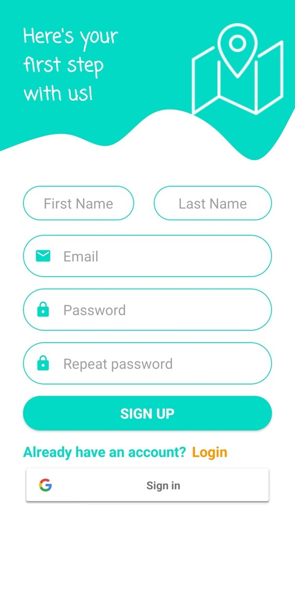 
The signup page of our app Smart Guide. The user can’t sign up without filling the whole form. The email will go through a verification phase from the firebase. If the user already has an account, they can click the Login button to redirect them to the login page. At last, the user can immediately sign in without even signing up by using the sign in with Gmail button.

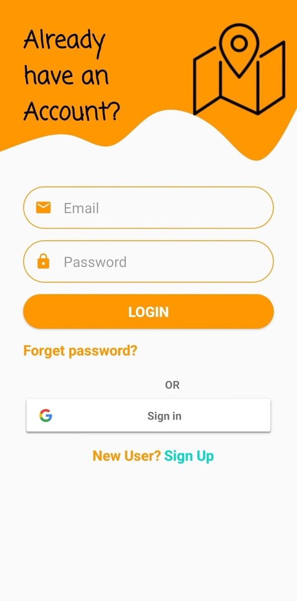 

The login page of the Smart Guide app. The user can get into the app in two ways the first is by logging in with his created account through the sign-up page (shown above) or immediately by signing in with his Gmail. If he already has an account but forgot his password, he can use his email that’s associated with his account to get a reset password from the firebase through a pop-up 

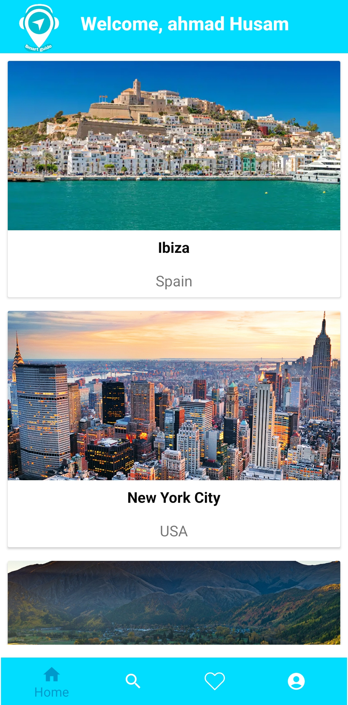 

The user's home page (after logging in or registering). Displays all places added by the administrator.

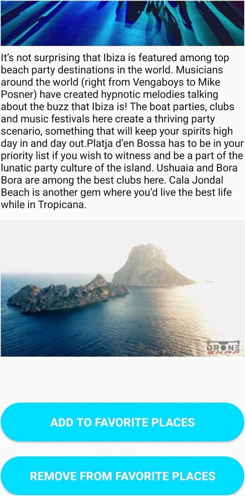

The place details page (shown when userclick on a place) of our Smart Guide app, which contains a description, photo and video about the place the admin added. The user can add the place to his favourites and if the place is already in the favourites, a remove from favourites button will appear so that he can remove the place from the favourites if he wants to.

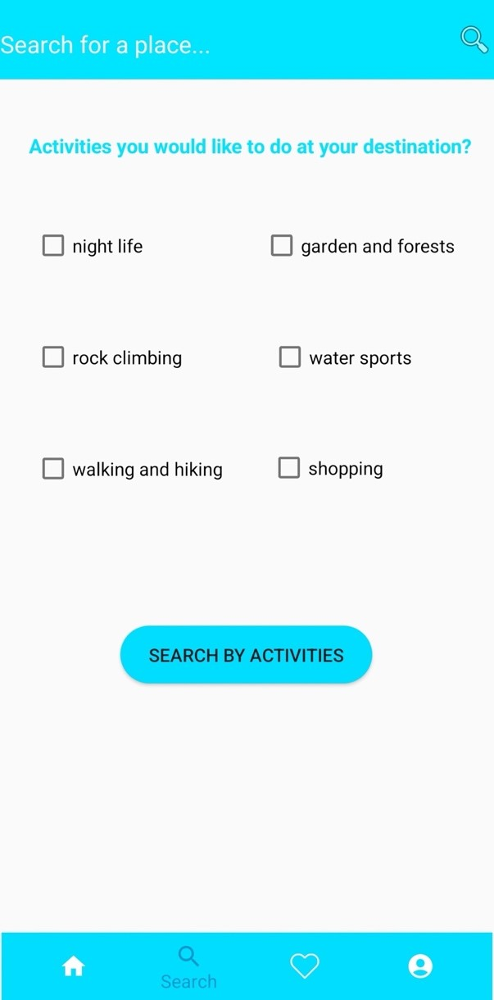 

The user search page he can search by activities he wants to do in the place or by place name. User selects the activities he wants and click search by activity button to view all the places that have those activities.

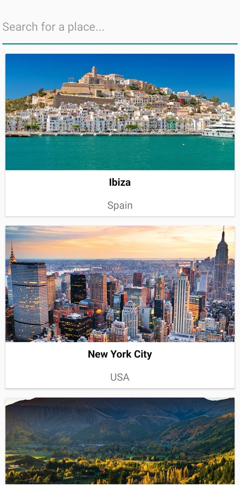 

The user search by place name page of our app Smart Guide. User puts a letter(s) of the place name or the full name to show the available places related to that name or letter(s).

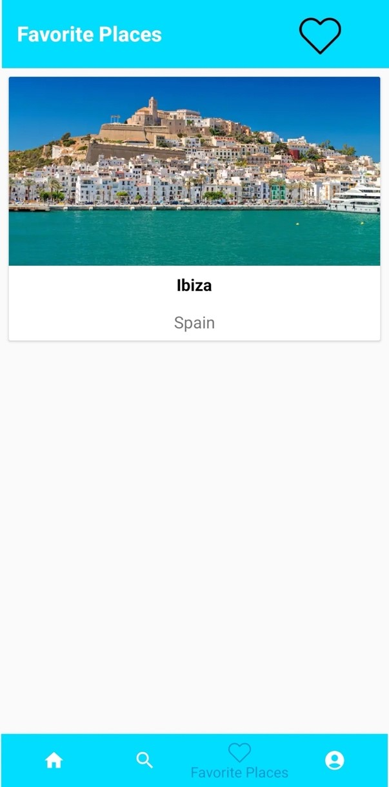 

The user favorite places page of our app Smart Guide. User can see all of the places he has added to his favorites, and he can click on any place to see its description and he has the ability to remove it from favorites .

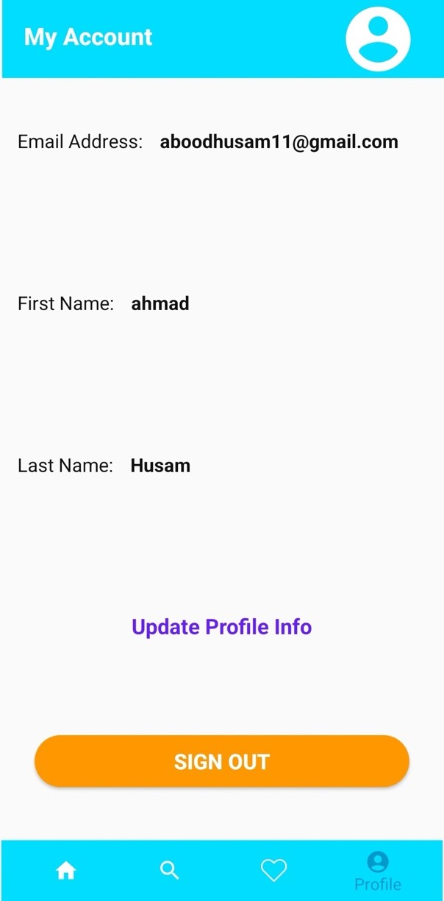 

The user info page of our app Smart Guide. User can see all of the information of his profile on Smart Guide (email, first name, and last name) he can click on update profile info to go to another page to change his profile information.

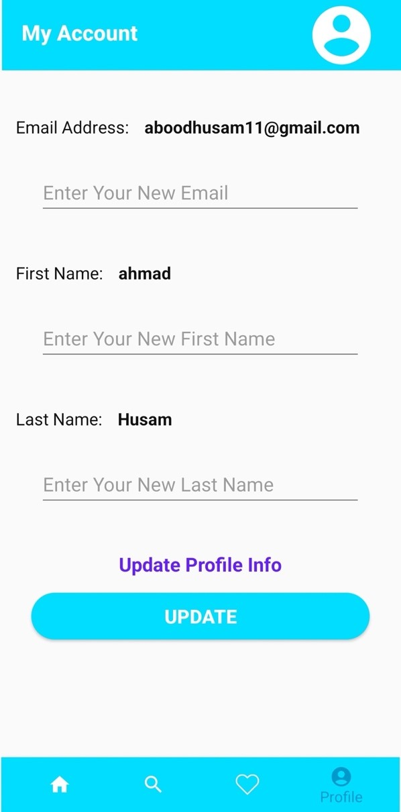 

The user update info page of our app Smart Guide. User can see all of his previous information of his profile on Smart Guide (email, first name, and last name) he can fill his new information and click on update to change his profile information.

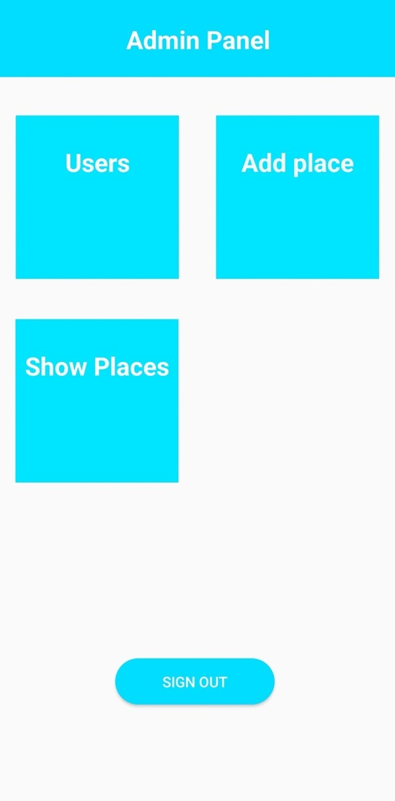 

The Admin Panel, of our app Smart Guide. The admin can click on users to see the online users’ number and all the registered users, he can click on Add Place to add a new place to Smart Guide database, or he can click on Show Places to see all the added places in the database.

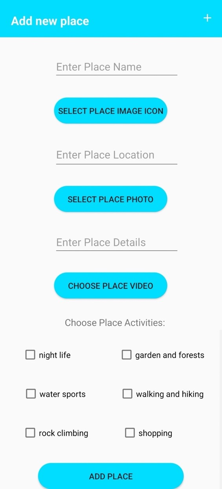 

The admin add a place page of our app Smart Guide. The admin must fill-out all the form from name, image icon, location, place photo, video, and activities.
